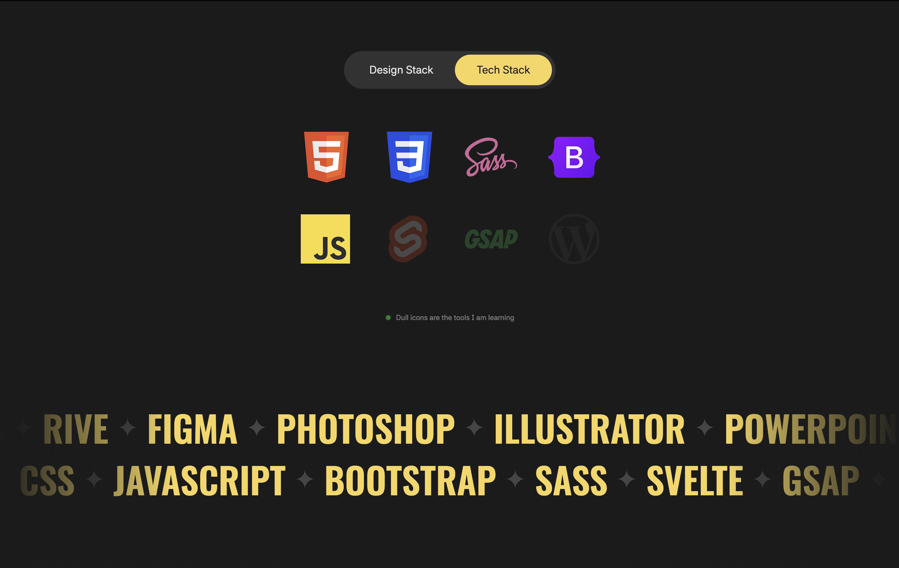
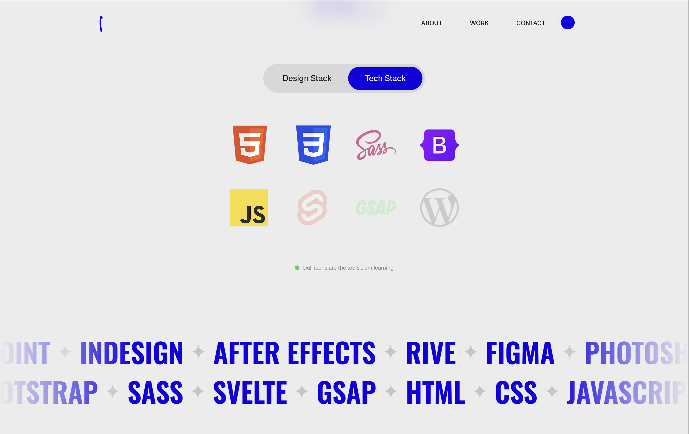

# 🎨 Portfolio Website

Having a background in UI and graphic design, I decided to delve into **UI Development**. This static portfolio website showcases the skills I’ve gained in both the **design stack** and **frontend tech stack** over the past few months.

---

## 🚀 Live Demo

👉 [Live Site](https://portfolio-website-mario.vercel.app/)

---

## 🛠 Built With

- **HTML5**, **SCSS**, and **Bootstrap 5**
- **GSAP** and **AOS** for scroll-based animations
- Vanilla **JavaScript** for custom interactions
- Deployed on **Vercel**

---

## ✨ Features

- Fully responsive layout across all devices
- Animated sections using CSS and JavaScript libraries
- Clean, semantic code with modular SCSS structure

---

## 🖼 Preview






## ⚙️ Usage / Setup Instructions

To run the project locally:

```bash
# Clone the repository
git clone https://github.com/marioalbinodias/portfolio-website.git

# Navigate into the project folder
cd portfolio-website

Open index.html in your browser directly, or use a development server like:
	•	Live Server (VSCode extension)
	•	XAMPP/MAMP for local server setup
	•	Live Sass Compiler for SCSS auto-compilation
